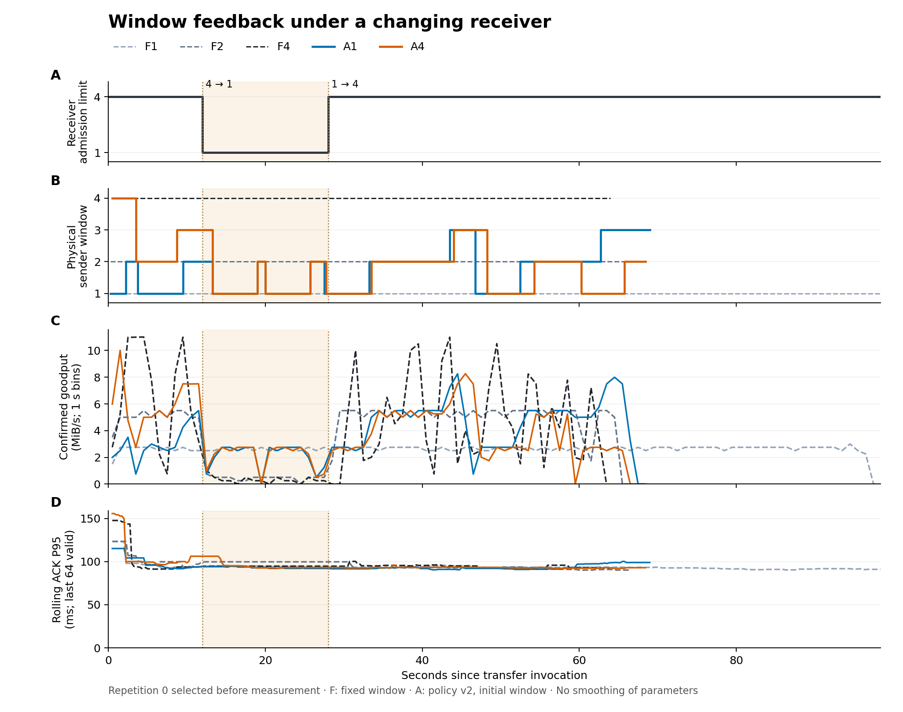

# LightningCipherPipe

LightningCipherPipe 是用 Java 17 实现的安全流式传输研究原型，传输内核独立于数据库，支持认证加密、持久回执和有界并发。项目研究接收端处理能力变化时，轻量反馈对初始窗口选择和传输性能的影响。

[系统架构](docs/architecture.md) · [快速接入](docs/sdk.md) · [实验结果](docs/experiments/README.md) · [后续计划](docs/roadmap.md)

## 设计要点

- 数据和回执刷盘后才确认块。传输结束时，目标重读输出，核验 SHA-256 与 Merkle 根后发布完成结果。
- 按完成顺序回收在途槽位，字节许可覆盖块的完整处理周期；缓冲和索引各有独立预算。
- TLS 1.3 双向认证保护连接，HPKE Auth 将独立分块绑定到握手上下文。
- 在认证范围内试探窗口和块大小，用吞吐与 ACK 延迟评估候选参数。压力退让和冷却规则控制调整频率。
- Source/Sink SPI 负责接入输入源和目标存储，文件适配器给出持久化契约的参考实现。

## 实验观察

在接收并发容量按 **4 → 1 → 4** 变化的受控实验中，三个固定窗口与两个自适应初值（可选 v2，仅开放窗口调节）使用相同的 256 MiB 输入、256 KiB 分块和 ZSTD 3，每组运行三个独立 JVM，共 15 次传输。常规配置默认策略版本为 v1。

| 指标 | 固定窗口端点 F1/F4 | 自适应初值 A1/A4 |
| --- | ---: | ---: |
| 三轮初值敏感性范围 | 53.85%–68.30% | **0.81%–14.87%** |
| 完成时间中位数 | F1：98.381 s；F4：61.287 s | A1：70.304 s；A4：68.445 s |

初值敏感性定义为同轮两种初值耗时的绝对差除以较小值。实验在单机上运行双端，使用真实 TLS/HPKE 和文件持久化，统计基于三次重复。完整耗时对照见研究报告，恢复效率优化见[后续计划](docs/roadmap.md)。



[完整研究报告](docs/experiments/window-adaptation-v1/README.md)提供全部对照、响应时间和原始轨迹。[策略简化实验](docs/experiments/policy-v2/README.md)另在 sink/journal 两类诊断场景中观察到二维策略相对三维策略的中位完成时间分别降低 **20.0% / 16.5%**；同场景固定对照的耗时及全部样本一并列于报告。

## 快速开始

准备 JDK 17，将 `JAVA_HOME` 指向该 JDK。仓库内 Maven Wrapper 负责构建工具与依赖下载。

```sh
./mvnw clean install
```

Windows PowerShell：

```powershell
.\mvnw.cmd clean install
```

运行双节点演示测试，验证独立 JVM 传输、目标重启恢复及输出内容：

```powershell
.\mvnw.cmd -pl examples -am test "-Dtest=TransferNodeTest" "-Dsurefire.failIfNoSpecifiedTests=false"
```

源码安装后，应用可引用 `io.github.aullchen:lcp-transport-http:0.1.0-SNAPSHOT`；ZSTD 由同版本 `lcp-compression-zstd` 提供。手动传输文件、生成 localhost 演示身份和装配 SDK，见 [接入指南](docs/sdk.md)与[配置模板](examples/config/)。

## 仓库导航

| 目录 | 职责 |
| --- | --- |
| `modules/api` | JDK 值对象与 Source/Sink 契约 |
| `modules/core` | 协议编码、分块、预算、完整性与反馈 |
| `modules/security` | HPKE、密钥与身份绑定 |
| `modules/transport-http` | 认证传输、并发协调、对账与重试 |
| `modules/compression-zstd` | 有界 ZSTD 编解码 |
| `examples` | 文件适配器、双节点入口与集成测试 |
| `protocol/vectors` | 编码与密码协议测试向量 |
| `benchmarks` | 对照实验、轨迹分析与绘图工具 |
| `docs` | 架构、接口、实验与后续计划 |

## 验证与复现

Java 测试使用 JDK 17；实验分析测试另需 Python 3.10+。

```powershell
.\mvnw.cmd test
.\mvnw.cmd -Pbenchmarks clean verify
python -m unittest discover -s benchmarks -p test_window_adaptation_report.py -v
```

测试覆盖协议向量、真实 TLS 传输、持久化边界和子进程恢复。性能矩阵按独立命令运行，方法与环境见 [实验工具指南](benchmarks/README.md)。参考文件系统为 Windows 11 / NTFS，每个 Sink 根目录运行一个活动任务；源进程重启通过持久控制记录查询旧任务，再决定下一次传输。

## 技术文档

[架构](docs/architecture.md) · [构建依赖](docs/build-baseline.md) · [SDK](docs/sdk.md) · [安全](docs/security.md) · [传输与恢复](docs/transfer.md) · [文件持久化](docs/storage.md) · [压缩](docs/compression.md) · [反馈策略](docs/feedback.md) · [指标定义](docs/metrics.md)

欢迎在 Issue 或 Pull Request 中提供复现步骤、预期行为和验证结果。问题报告应使用脱敏配置与合成输入。

## 许可证

原创代码采用 [MIT License](LICENSE)。Maven Wrapper 与第三方依赖保留各自的许可证声明。
