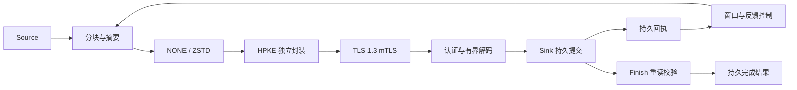

# 系统架构

LightningCipherPipe 的边界是有限字节流的安全交付。业务通过 Source 提供输入，通过 Sink 接收持久块与完成结果，传输层负责身份绑定、资源协调和结果确认。

## 数据路径

## 模块与扩展边界

`lcp-api` 定义 Source/Sink、元数据与结果对象，仅依赖 JDK。`lcp-core` 实现确定性编码、资源预算、分块与完整性校验。`lcp-security` 提供密码操作，HTTP 适配器负责认证连接和请求协调。ZSTD 是独立可选模块。

参考 FileSink 位于 examples，与数据库事务和业务导入分离。接入其他存储时，适配器须满足同样的持久回执、幂等提交和状态恢复契约。

## 三个关键约束

**确认代表持久事实。** 接收端按 payload 写入与 force、receipt 追加与 force、索引发布的顺序提交。响应丢失后，源端通过回执对账识别已持久提交的块。Finish 进一步核验连续范围、总长度、逐块摘要和 Merkle 根。

**预算覆盖数据的存活时间。** 源端在准备块前预留完整生命周期的峰值字节许可，消费者退出后释放。调度窗口同时受认证范围、目标槽位和字节预算约束。历史描述符使用单独的元数据预算。

**调参保持块身份稳定。** 已准备块保持索引、偏移、摘要和压缩材料。反馈参数作用于后续新块；重试对已有材料建立新的 HPKE 上下文。由此将控制实验与重传一致性分开。

## 控制与观测

固定策略与反馈策略共用发送、对账和持久化路径。反馈每轮至少采集 16 个有效 ACK、经过 2 秒；每个试探评估两轮，再冷却两轮。v1 调整窗口、压缩等级和块大小，v2 固定压缩等级并调整另外两维，默认版本为 v1。

观测使用最近 64 个有效 ACK 的滚动 P95、确认字节、压缩耗时和压力计数。研究工具记录共同时间轴上的容量、窗口、吞吐与延迟，帮助区分决策计算成本和低窗口运行的时间成本。

## 恢复路径

存活源遇到未知响应时暂停新读取、排空在途请求并分页对账，然后重发缺失块。目标重启回放 receipt 日志并执行持久化屏障。源进程重启读取 SourceControl，查询旧任务的完成或取消事实；后续传输使用新的任务身份和完整输入。

接口细节见[传输与恢复](transfer.md)、[文件持久化](storage.md)和[安全绑定](security.md)。实验方法与证据见[实验索引](experiments/README.md)。
